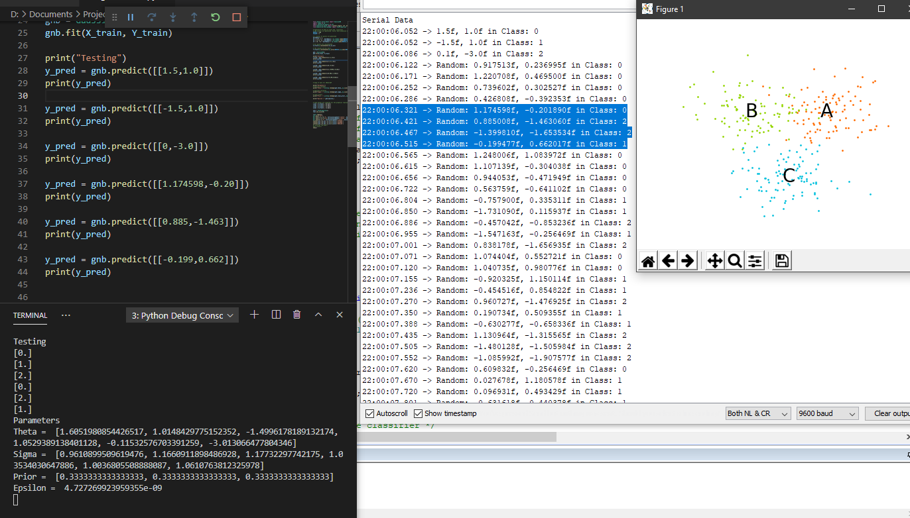
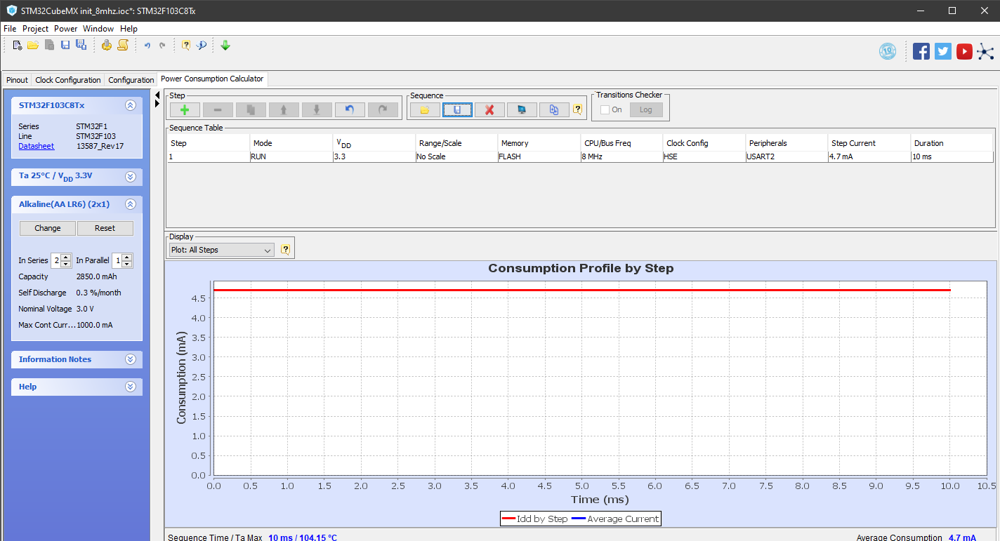

# NaiveBayes_STM32_CMSIS-DSP
Implementation of Gaussian Naive Bayes classification on STM32 ARM Cotex M3 microcontroller using CMSIS-DSP ([CMSIS 5.7.0](https://github.com/ARM-software/CMSIS_5)) library. The project is written in Keil uVision 5.

The training of the classifier was done using [Scikit Learn](https://scikit-learn.org/stable/) package in Python 3. The script can be found [here](./Python).
The training data generated are three concatenated random cluster of  points(100 vectors) having 2 dimension that can be represented on a cartesian plane. 
The classifier was trained on these points and four Gaussian parameters were generated. The parameters are *Gaussian averages*,  *Gaussian variances*, *Class priors* and *Epsilon range*. 

This parameters were used in the firmware for inferencing of random data points generated in the ARM microcontroller. After each classification at 10ms interval an led at `PB12` is toggled as an indication. Classification data is shown as output in a serial terminal. The GPIO and UART peripheral can be disabled to save **150 µA**.

The inference result is validated and the result can be seen below:

  

The Gaussian classifier was used to classify randomly user defined points and the result is represented as **classes**. The classes are named as **0**,**1** and **2** which can pictorially be assigned on the points cluster A, B and C respectively. 
The pictorial representation of cluster of points is shown below:

  

# Hardware Configuration
- **System Clock**: HSI 8 MHz and HSE 8MHz(Highest 72 MHz). HSE crystal frequency can be as low as 4Mhz which is lowest for STM32F103xB.
    - Reason: Low Power consumption and future scope of USB implementation. USB, as per the spec, requires the frequency to be within 0.25% (2500 ppm) of the ideal value. In the datasheet of STM32F103xB (chapter 5.3.7) HSI is guaranteed to have a tolerance of -1.1% to +1.8% at 25°C. The test of the project was done with 8Mhz clock frequency due to limited hardware resource. 

- **Average Current Consumption**: 4.1mA with UART Peripheral enabled(Current consumption: 97.76 µA), Core clock frequency at 8Mhz and a step duration for 10ms. The power consumption can be optimised by switching to STANDBY mode after each conversion and then waking the MCU which requires LSE clock for accurate wakeup. 

A power consumption profile for *RUN Mode* by step is shown below:

  

