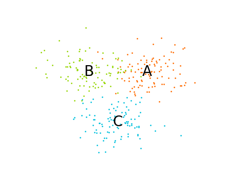

# NaiveBayes_STM32_CMSIS-DSP
Implementation of Gaussian Naive Bayes classification on STM32 ARM Cotex M3 microcontroller using CMSIS-DSP library. The project is written in Keil uVision 5.

The training of the classifier was done using [Scikit Learn](https://scikit-learn.org/stable/) package in Python 3. The script can be found [here](./Python).
The training data generated are three concatenated cluster of points(100 vectors) having 2 dimension that can be represented on a cartesian plane. The Gaussian classifier was used to classify randomly user defined points and the result is represented as **classes**. The classes are named as **0**,**1** and **2** which can pictorially be assigned on the points cluster A, B and C respectively as seen on the image below

  

